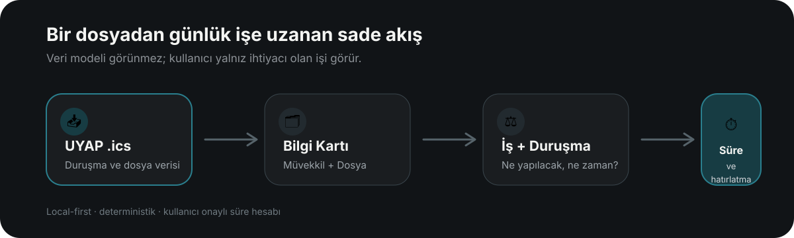

  <strong>⚖️ Hukuk pratiğine özel</strong> · <strong>🖥️ macOS + Windows</strong> · <strong>🔒 Local-first</strong> · <strong>🆓 Ücretsiz</strong>

  <a href="../../releases/latest"><strong>⬇️ Son kararlı sürümü indir</strong></a>

---

# NöbetçiTakvim

**Avukatlar için masaüstü iş, duruşma ve hukuki süre takip uygulaması.**  
*Her iş, vaktinde.*

NöbetçiTakvim; duruşmaları, yapılacak işleri, hukuki süreleri, müvekkilleri ve dosyaları tek bir sade çalışma alanında toplar. Amacı yeni bir büro yönetim sistemi kurmak değil; hukuk pratiğinde **unutulmaması gereken işi, doğru zamanda ve doğru dosyayla birlikte görünür kılmaktır.**

> **Verilerin ana kaydı cihazınızda tutulur.** Bu depo yalnız NöbetçiTakvim’in macOS ve Windows dağıtım paketlerini içerir; kaynak kod içermez.

## 📌 Neden NöbetçiTakvim?

Hukuk pratiğinde takip edilmesi gereken şeyler aynı türden değildir: bir dosyada duruşma, diğerinde bilirkişi raporuna beyan, başka bir dosyada tebligata bağlı son gün veya yerine getirilmesi gereken bir ara karar vardır.

NöbetçiTakvim bu farklı işleri tek ve anlaşılır bir akışta bir araya getirir.

| | |
| --- | --- |
| 🧾 **İş ve süre takibi** | Süreli veya süresiz işleri kaydedin; hatırlatmaları ihtiyacınıza göre yönetin. |
| 🏛️ **Duruşma takvimi** | Yaklaşan duruşmaları tarih ve saat sırasıyla tek ekranda görün. |
| 📥 **UYAP `.ics` içe aktarma** | UYAP Avukat Portal’dan alınan takvim dosyalarını içe aktarın; uygun müvekkil ve dosya kartları otomatik oluşsun. |
| 🗂️ **Bilgi Kartı** | Müvekkilleri ve dosyaları birbirine bağlı, fakat birbirinden bağımsız kayıtlar olarak yönetin. |
| ⏱️ **Hukuki süre hesabı** | Tebligata bağlı sürelerde son günü deterministik olarak hesaplayın; kullanıcı onayı olmadan kaydetmeyin. |
| ⚖️ **Gerçek UYAP evrak türleri** | Hukuk, ceza, idari yargı, icra ve soruşturma dosyalarında bağlama uygun öneriler alın. |
| 🔎 **Türkçe arama** | Büyük/küçük harf farkından bağımsız, Türkçe karakterlerle uyumlu arama yapın. |
| 📊 **Excel dışa aktarımı** | İş ve dosya listelerini Excel’e aktarın. |
| 🌗 **Açık / koyu tema** | Tema tercihinizi kalıcı olarak saklayın. |
| ♿ **Erişilebilir kullanım** | Klavye erişimi, görünür odak durumları ve ekran okuyucu etiketleriyle çalışın. |

  

## ✨ Hukuki sürelerde son söz kullanıcıda

NöbetçiTakvim süreyi sizin yerinize **kesinleştirmez**. Hesaplamayı açık kurallarla yapar, sonucu gösterir ve **hesaplanan son tarih kullanıcı tarafından doğrulanmadan kaydetmez.**

Bu yaklaşım bilinçlidir: uygulama mekanik işi azaltır; hukuki değerlendirme ve nihai sorumluluk kullanıcıda kalır.

## 🧭 UYAP ile birlikte, UYAP’ın yerine değil

NöbetçiTakvim UYAP’ın yerini almaya çalışmaz. UYAP Avukat Portal’dan alınan `.ics` takvim dosyalarını yerel çalışma düzeninize taşır ve bunları daha kullanılabilir bir iş/dosya yapısına dönüştürür.

İçe aktarma sırasında:

- vekili olunan taraflardan müvekkil kartları oluşturulabilir,
- mahkeme/kurum ve dosya numarasından dosya kartları oluşturulabilir,
- aynı veri yeniden içe aktarıldığında mükerrer kayıt üretmemeye çalışılır,
- elle eklediğiniz müvekkil bilgileri otomatik içe aktarma nedeniyle ezilmez.

## ⬇️ İndir

> ### **[Releases sayfasından en güncel kararlı sürümü indirin.](../../releases/latest)**

| Platform | Paket | Durum |
| --- | --- | --- |
| 🍎 **macOS — Apple Silicon** | `NobetciTakvim-<sürüm>-arm64.dmg` | Developer ID ile imzalı ve Apple tarafından notarize edilmiş |
| 🪟 **Windows — x64** | `NobetciTakvim.Setup.<sürüm>.exe` | NSIS kurulum paketi |

### 🍎 macOS

DMG dosyasını açın ve NöbetçiTakvim’i **Applications / Uygulamalar** klasörüne taşıyın. macOS paketleri **Apple Developer ID** ile imzalanır ve Apple tarafından **notarize** edilir.

### 🪟 Windows

Windows sürümü NSIS kurulum paketi olarak dağıtılır. Mevcut Windows paketi kod imzasız olduğundan SmartScreen ilk kurulumda uyarı gösterebilir.

## 🔐 Veri mahremiyeti

NöbetçiTakvim, yalnız sizin erişim yetkiniz bulunan verilerle çalışır ve bu verileri esas olarak kendi bilgisayarınızda işler. UYAP .ics dosyalarından alınan bilgiler de cihazınızda işlenir ve yerel veritabanınızda tutulur.

NöbetçiTakvim geliştiricisinin kullanıcıların uygulamalarına, yerel veritabanlarına, müvekkil bilgilerine, dosya bilgilerine, duruşmalarına veya diğer kayıtlarına uzaktan erişim imkânı bulunmamaktadır. Uygulamada geliştiricinin bu verilere erişmesini sağlayan bir merkezi sunucu, kullanıcı hesabı altyapısı, yönetim paneli veya benzeri bir uzaktan erişim mekanizması yoktur.

Bu nedenle uygulamaya kaydettiğiniz veriler, siz ayrıca ve bilerek paylaşmadığınız sürece geliştiriciye, geliştiricinin bilgisayarına veya başka bir üçüncü kişiye aktarılmaz. NöbetçiTakvim bu verileri geliştirici adına herhangi bir harici veri merkezinde de saklamaz.

Google Takvim entegrasyonu tamamen isteğe bağlıdır. Google Takvim kullanmasanız da NöbetçiTakvim’in masaüstü bildirimlerinden yararlanabilirsiniz. Google Takvim bağlantısını etkinleştirmeniz hâlinde, entegrasyonun çalışması için gerekli takvim verileri Google’ın sunucularıyla paylaşılabilir. Bu durumda veri Google hizmeti kapsamında işlenebilir; ancak bu paylaşım geliştiriciye erişim hakkı vermez ve söz konusu veriler geliştiricinin sistemlerine aktarılmaz.

Özetle: NöbetçiTakvim’de tuttuğunuz hukuk verilerine geliştiricinin teknik erişimi yoktur. Verileriniz kendi bilgisayarınızda kalır; Google Takvim’i siz özellikle etkinleştirirseniz yalnız bu entegrasyon için gerekli veriler Google altyapısıyla paylaşılabilir.

## 🤲 Küçük bir ricam

> Bu uygulama, meslektaşlarımın işini kolaylaştırmak amacıyla ücretsiz olarak sunulmaktadır. Karşılığında sizden tek ricam, başta anneannem olmak üzere, ahirete irtihal etmiş tüm Türk büyüklerim için bir dua etmenizdir.

## 🧪 Dosya doğrulama

Her sürümün release notlarında yayımlanan paketler için **SHA-256** özetleri bulunur. İndirdiğiniz dosyanın bütünlüğünü bu değerlerle doğrulayabilirsiniz.

## 🧱 Bu depo hakkında

Bu repository yalnız son kullanıcıya sunulan NöbetçiTakvim paketlerinin dağıtımı içindir.

**Kaynak kod bu depoda yayımlanmaz.**

---
## Meslektaşlarımdan Bir Ricam Var

Kıymetli meslektaşlarım,

Ben yazılımcı değilim. Yalnızca yapay zekâ kullanmayı seven; vibe coding (sezgisel yazılım/yazılımsama) yöntemiyle, yani geliştiricilerin tek tek kod satırları yazmak yerine kendi anadillerinde ne yapmak istediklerini yapay zekâya anlatarak yazılım geliştirdiği yeni nesil yaklaşımdan yararlanıp kendimin ve meslektaşlarımın işine yarayacak araçlar üretmeye çalışan bir hukukçuyum.

Bu nedenle Değişikİş'in hataları, eksikleri veya geliştirilmesi gereken yönleri olabilir. Uygulamayı kullandıkça karşılaştığınız sorunları, dileklerinizi, önerilerinizi ve eleştirilerinizi benimle paylaşırsanız, Değişikİş'i birlikte daha iyi bir hale getirebiliriz.

Uygulamayı sizlere ücretsiz olarak sunuyorum. Bunun karşılığında tek beklentim; beni yetiştiren müteveffa anneannem Cemile Salman’ın aziz ruhu ve hatırası için, kendi inancınız çerçevesinde bir dua etmenizdir.

Sevgiler,  
Raci

---

  <strong>NöbetçiTakvim</strong> — <em>Her iş, vaktinde.</em> 
  © 2026 Raci Çetin Yüksekbaş

